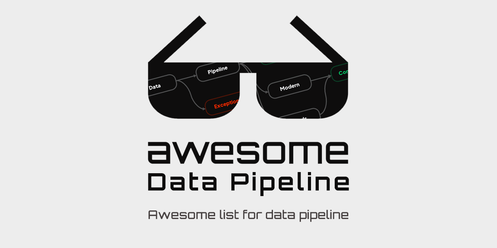

<h1 align="center">Awesome Data Pipeline</h1>

Awesome list for Data Pipeline

:white_check_mark: **Data Pipeline** is:  
A series that moves data from source to destination efficiently and automatically.

# Table of contents

- [Components](#components)
   - [Workflow Management](#workflow-management)
   - [Data Ingestion](#data-ingestion)
   - [Data Lake](#data-lake)
   - [Data Warehouse](#data-warehouse)
   - [Data Store](#data-store)
   - [Query Engine](#query-engine)
   - [Data Storage](#data-storage)
   - [Streaming](#streaming)
   - [Data Analysis](#data-analysis)
   - [Data Format](#data-format)
   - [Business Intelligence](#business-intelligence)
   - [AI/ML](#aiml)
- [Community](#community)
   - [Vendors](#vendors)
   - [Open Source / Foundation](#open-source--foundation)

# Components

## Workflow Management

- [Apache Airflow](https://airflow.apache.org/) (Apache foundation / Airbnb / Open Source / Free)
- [Apache Argo](https://argoproj.github.io/argo-workflows/) (CNCF foundation / Kubernetes-friendly / Open Source / Free)
- [Apache NiFi](https://nifi.apache.org/) (Apache foundation / Dataflow / Free)
- [Luigi](https://luigi.readthedocs.io/en/stable/) (Spotify / Open Source / Free)
- [Azure Data Factory](https://azure.microsoft.com/en-us/services/data-factory/) (Azure Cloud / Subscription fee)

## Data Ingestion

- [Apache Flume](https://flume.apache.org/) (Apache foundation / Data Ingestion / Open Source / Free)
- [Stitch](https://www.stitchdata.com/) (Talend / ETL / Subscription fee)
- [Logstash](https://www.elastic.co/logstash/) (Elastic / Data Ingestion / Cloud or On-prem / Hybrid fee)
- [Filebeat](https://www.elastic.co/beats/filebeat) (Elastic / Data Ingestion / Cloud or On-prem / Hybrid fee)
- [Fluentd](https://www.fluentd.org/) (CNCF foundation / Open Source / Free or License fee)
- [Datadog](https://www.datadoghq.com/) (Datadog / Cloud / APM / Subscription fee)
- [New Relic](https://newrelic.com/) (New Relic / Cloud / APM / Subscription fee)

## Data Lake

- [Hadoop File System (HDFS)](https://hadoop.apache.org/docs/r1.2.1/hdfs_design.html#Introduction) (Hybrid / Open Source / Hadoop-ecosystem)
- [AWS S3](https://aws.amazon.com/en/s3/) (AWS Cloud / Stroage Object)
- [Azure Blob Storage](https://azure.microsoft.com/en-us/services/storage/blobs) (Azure Cloud / Storage Object)
- [GCP Cloud Storage](https://cloud.google.com/storage/?hl=en) (Google Cloud / Storage Object)
- [Databricks Delta Lake](https://databricks.com/product/delta-lake-on-databricks) (Hybrid / Multi-cloud / Open Source)

## Data Warehouse

- [Aapache Hive](https://hive.apache.org/) (Apache foundation / Hadoop-friendly / MapReduce / Free)
- [Snowflake](https://www.snowflake.com/) (Multi-cloud / SQL-friendly / Subscription fee)
- [AWS Redshift](https://aws.amazon.com/en/redshift/) (AWS Cloud / SQL-friendly / Subscription fee)
- [Azure Synapse Analytics](https://azure.microsoft.com/en-us/services/synapse-analytics/) (Azure Cloud / SQL-friendly / Subscription fee)
- [GCP BigQuery](https://cloud.google.com/bigquery/) (Google Cloud / SQL-friendly / On-demand fee)
- [IBM DB2](https://www.ibm.com/us-en/products/db2-database) (IBM / On-prem / SQL-friendly / Subscription fee)

## Data Store

- [Apache Druid](https://druid.apache.org/) (Apache foundation / Real-time datastore / Free)
- [Apache Pinot](https://pinot.apache.org/) (Apache foundation / Real-time datastore / Free)
- [AWS Aurora](https://aws.amazon.com/en/rds/aurora/) (AWS Cloud / Rich-cloud datastore / Subscription fee)
- [GCP Cloud Spanner](https://cloud.google.com/spanner/) (Google Cloud / HA datastore that breaks away from CAP / Subscription fee)
- [Azure Cosmos DB](https://azure.microsoft.com/en-us/free/cosmos-db/) (Azure Cloud / NoSQL datastore / Subscription fee)

## Query Engine

- [Presto](https://prestodb.io/) (Facebook / Open Source / SQL-friendly / Free or License fee)
- [Apache Impala](https://impala.apache.org/) (Apache foundation / Cloudera / Open Source / SQL-friendly / Free or License fee)
- [AWS Athena](https://aws.amazon.com/en/athena/) (AWS Cloud / SQL-friendly / On-demand fee)
- [AWS Redshift Spectrum](https://docs.aws.amazon.com/en_us/redshift/latest/dg/c-using-spectrum.html) (AWS Cloud / SQL-friendly / On-demand fee)

## Streaming

- [Apache Kafka](https://kafka.apache.org/) (Apache foundation / Confluent / Linkedin / Message Broker / Open Source / Free or License fee)
- [RabbitMQ](https://www.rabbitmq.com/) (VMWare / Messaging Queue / Free or License fee)
- [AWS Kinesis](https://aws.amazon.com/en/kinesis/) (AWS Cloud / Message Broker / Subscription fee)
- [AWS SQS](https://aws.amazon.com/en/sqs/) (AWS Cloud / Messaging Queue / Subscription fee)
- [GCP PubSub](https://cloud.google.com/pubsub/) (Google Cloud / Message Borker / Subscription fee)
- [Azure Event Hub](https://azure.microsoft.com/en-us/services/event-hubs/) (Azure Cloud / Messsage Borker / Subscription fee)

## Data Transformation

- [Apache Spark](https://spark.apache.org/) (Apache foundation / Databricks / In-memory processing / Open Source / Free or License fee)
- [Apache Beam](https://beam.apache.org/) (Apache foundation / Google / Data processing / Open Source / Free or License fee)
- [Apache Storm](https://storm.apache.org/) (Apache foundation / Backtype / Twitter / Stream processing / Open Source / Free)
- [Apache Flink](https://flink.apache.org/) (Apache foundation / Stream processing / Open Source / Free)
- [AWS Glue](https://aws.amazon.com/en/glue/) (AWS Cloud / Integrated Data System / ETL / On-demand fee)

## Data Analysis

- [Apache Superset](https://superset.apache.org/) (Apache foundation / Airbnb / Business Intelligence (BI) / Open Source / Free)
- [Apache Airpal](http://airbnb.io/airpal/) (Apache foundation / Airbnb / Query Editor / Open Source / Free)
- [Apache HUE](https://gethue.com/) (Apache foundation / Cloudera / Query Editor / Open Source / Free)
- [Kibana](https://www.elastic.co/kibana/) (Elastic / Dashboard / Hybrid fee)
- [Databricks Notebook](https://docs.databricks.com/notebooks/index.html) (Databricks / Notebook / Hybrid fee)
- [Jupyter Notebook](https://jupyter.org/) (Jupyter / Notebook / Open Source / Free)
- [Pandas](https://pandas.pydata.org/) (NumFOCUS / Data processing / Open Source / Free)
- [Plotly](https://plotly.com/) (Plotly / Data visualization / Hybrid fee)

## Data Format

- [Apache Parquet](https://parquet.apache.org/) (Apache foundation / Data Format / Open Source / Free)
- [Apache ORC](https://orc.apache.org/) (Apache foundation / Hortonworks / Facebook / Data Format / Open Source / Free)
- [Apache Avro](https://avro.apache.org/) (Apache foundation / Data Format / Open Source / Free)
- [Apache Kudu](https://kudu.apache.org/) (Apache foundation / Cloudera / Data Format / Open Source / Free)
- [Apache Arrow](https://arrow.apache.org/) (Apache foundation / Data Format / Open Source / Free)
- [Delta](https://delta.io/) (Databricks / Data Format / Free or License fee)
- [JSON](https://www.json.org/) (Data Format / Free)
- [CSV](https://en.wikipedia.org/wiki/Comma-separated_values) (Data Format / Free)
- [TSV](https://en.wikipedia.org/wiki/Tab-separated_values) (Data Format / Free)
- [HDF5](https://www.hdfgroup.org/solutions/hdf5/) (The HDF Group / Data Format / Open Source (licensed by [HDF5](https://www.hdfgroup.org/licenses.)) / Free)

## Business Intelligence

- [Apache Zeppelin](https://zeppelin.apache.org/) (Apache foundation / Business Intelligence (BI) / Open Source / Free or License fee)
- [Tableau](https://www.tableau.com/) (Salesforce / Business Intelligence (BI) / Hybrid fee)
- [Redash](https://redash.io/) (Redash Inc / Databricks / Business Intelligence (BI) / Hybrid fee)
- [Looker](https://looker.com/) (Looker Data Sciences Inc / Business Intelligence (BI) / Subscription fee)
- [Data Studio](https://datastudio.google.com/) (Google Cloud / Business Intelligence (BI) / Free)
- [PowerBI](https://powerbi.microsoft.com/) (Microsoft / Business Intelligence (BI) / Subscription fee)

## AI/ML

- [H2O](https://www.h2o.ai/) (H2O.ai / Model Evaluation / Subscription fee)
- [Feast](https://feast.dev/) (Tecton / Gojek / Feature Store / Open Source / Free)
- [Vertex AI](https://cloud.google.com/vertex-ai) (Google Cloud / Hybrid Features for AI / Subscription fee)
- [Data Robot](https://www.datarobot.com/) (DataRobot Inc / Feature Engineering / Subscription fee)
- [WandB](https://wandb.ai/) (Weights & Biases / Model Evaluation / Subscription fee)

# Community

## Vendors

- [Databricks | Data + AI Summit](https://databricks.com/dataaisummit)

## Open Source / Foundation

- [Kafka Summit](https://www.kafka-summit.org/)

# Materials

## Books

- [O'Reilly - Data Pipelines Pocker Reference](https://books.google.com/books?id=SxgcEAAAQBAJ&printsec=frontcover)
- [Manning - Data Pipeline with Apache Airflow](https://books.google.com/books?id=8EwnEAAAQBAJ&printsec=frontcover)

## Dummies Guide

- [Snowflake](https://www.snowflake.com/resource/snowflake-dummies-guides/)
- [Databricks](https://databricks.com/p/ebook/modern-cloud-data-platform-for-dummies)
